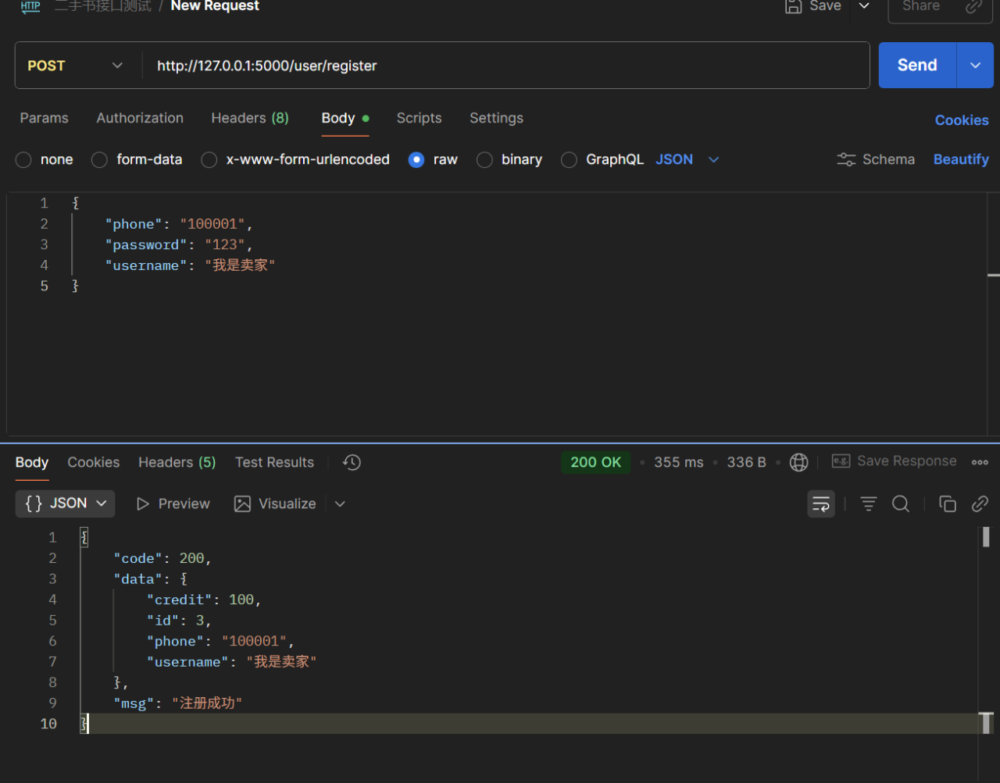
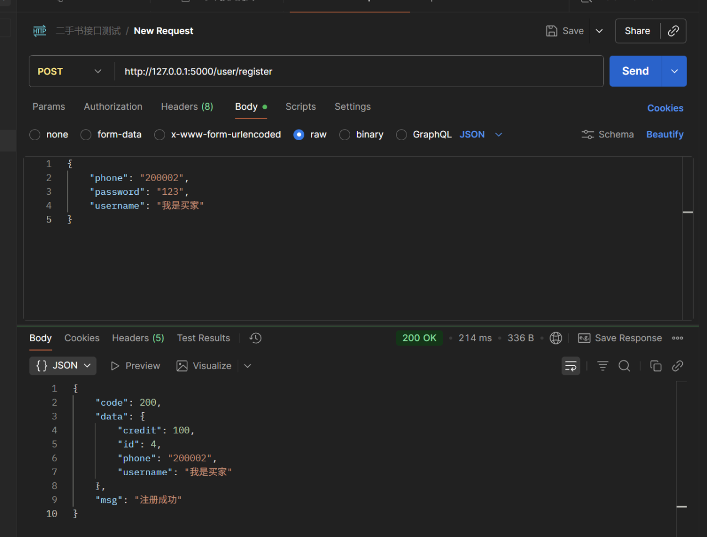
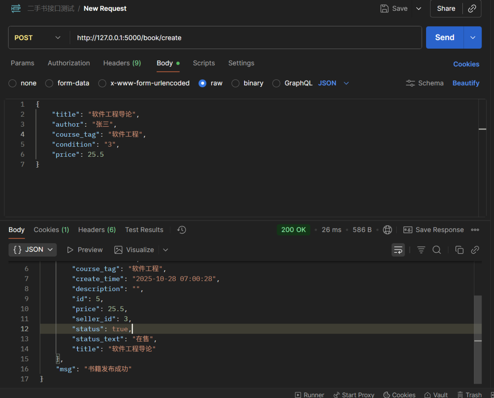
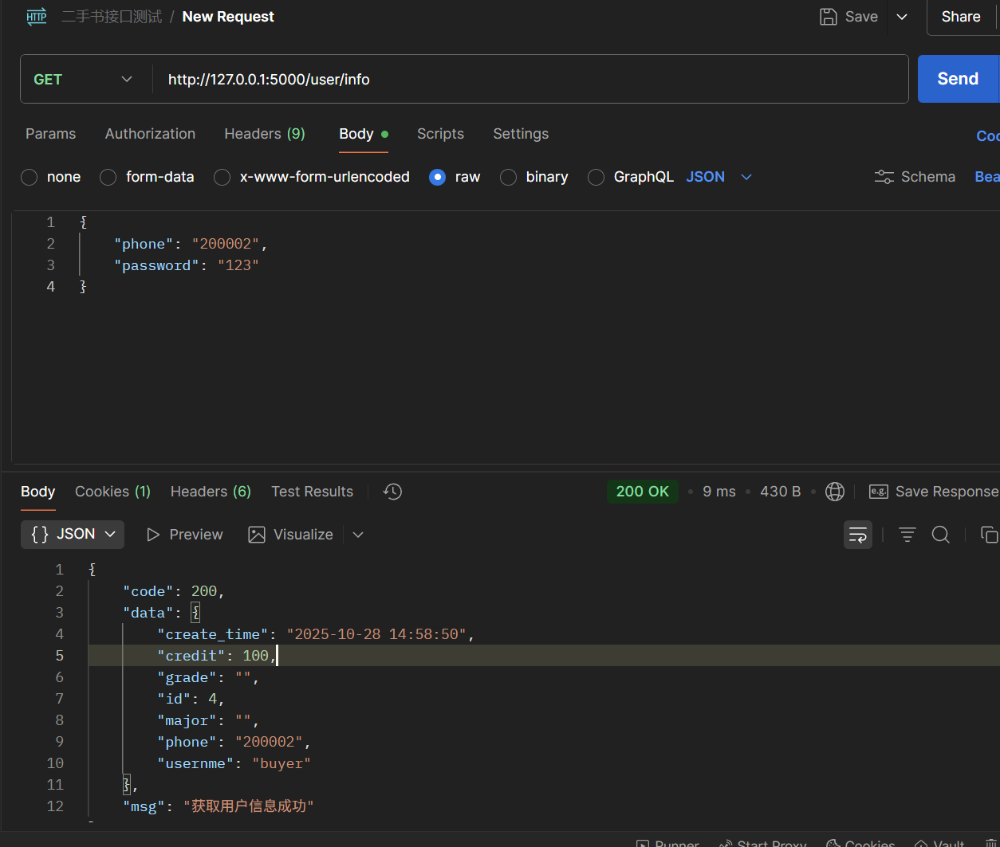
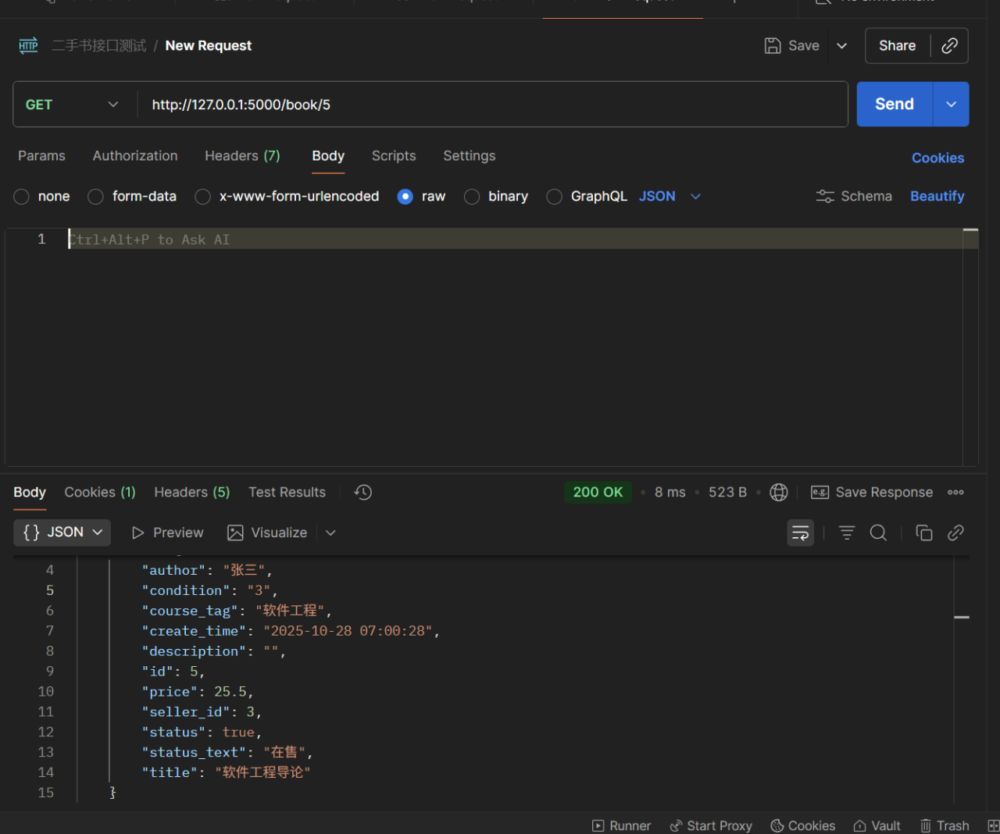
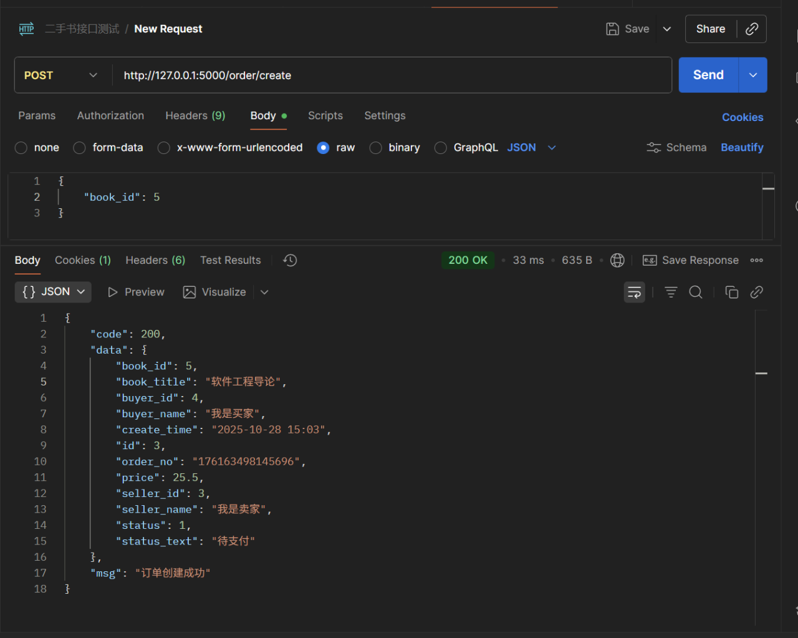
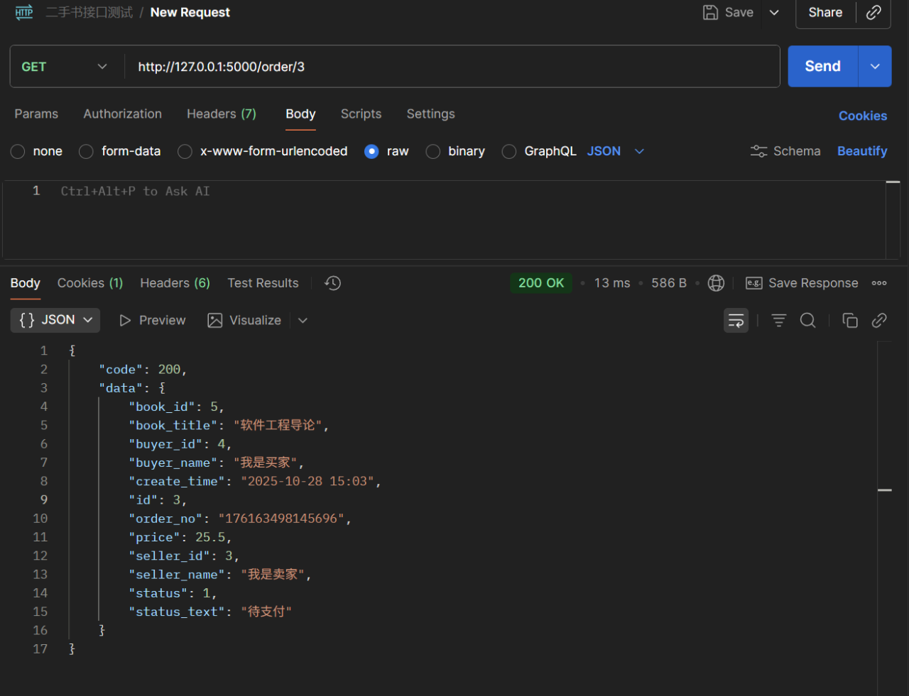

**只测试正确结果**的Postman流程。

###  测试准备

1.  **启动Flask服务器**：
    在你的项目根目录（`hust_se_2025_local`），确保你的虚拟环境 (venv) 已激活，然后运行：

    ```bash
    python run.py
    ```

    (你应该会看到它在 `http://127.0.0.1:5000/` 上运行)

2.  **打开Postman**。

3.  **前提**： `auth.py` 使用的是Session。Postman最棒的地方在于它**自动管理Cookie**。你登录后，Postman会自动保存Flask发来的 `session` Cookie，并在后续请求中自动带上它。**不需要**做任何额外配置。

-----

###  测试流程：从注册到查询（按顺序执行）

我们将模拟一个完整的“正确”流程：注册2个用户（卖家、买家）-\> 卖家登录 -\> 卖家发布书籍 -\> 买家登录 -\> 买家查询书籍 -\> 买家下单 -\> 买家查询订单详情。

#### 第1步：注册卖家

  * **Method**: `POST`
  * **URL**: `http://127.0.0.1:5000/user/register`
  * **Body**:
    1.  点击 `Body` 标签页
    2.  选择 `raw`
    3.  在右侧下拉菜单中选择 `JSON`
    4.  粘贴以下内容：
    <!-- end list -->
    ```json
    {
        "phone": "100001",
        "password": "123",
        "username": "我是卖家"
    }
    ```
  * **操作**：点击 `Send`。
  * **预期结果**：你会收到 `code: 200` 和 “注册成功”。
  

#### 第2步：注册买家

  * **Method**: `POST`
  * **URL**: `http://127.0.0.1:5000/user/register`
  * **Body** (JSON):
    ```json
    {
        "phone": "200002",
        "password": "123",
        "username": "我是买家"
    }
    ```
  * **操作**：点击 `Send`。
  * **预期结果**：你会收到 `code: 200` 和 “注册成功”。
  
#### 第3步：卖家登录

  * **Method**: `POST`
  * **URL**: `http://127.0.0.1:5000/user/login`
  * **Body** (JSON):
    ```json
    {
        "phone": "100001",
        "password": "123"
    }
    ```
  * **操作**：点击 `Send`。
  * **预期结果**：收到 `code: 200` 和 “登录成功”。Postman现在**自动保存了“卖家”的登录Session**。

#### 第4步：(卖家) 发布书籍

  * **Method**: `POST`
  * **URL**: `http://127.0.0.1:5000/book/create`
  * **Body** (JSON):
    ```json
    {
        "title": "软件工程导论",
        "author": "张三",
        "course_tag": "软件工程",
        "condition": "3",
        "price": 25.5
    }
    ```
  * **操作**：点击 `Send`。
  * **预期结果**：收到 `code: 200` 和 “书籍发布成功”。
  * **重要**：从返回的 `data` 中，**复制 `id` 的值**（为 `5`）。
    
#### 第5步：买家登录

  * **Method**: `POST`
  * **URL**: `http://127.0.0.1:5000/user/login`
  * **Body** (JSON):
    ```json
    {
        "phone": "200002",
        "password": "123"
    }
    ```
  * **操作**：点击 `Send`。
  * **预期结果**：收到 `code: 200` 和 “登录成功”。Postman现在**自动用“买家”的Session覆盖了“卖家”的Session**。

#### 第6步：(买家) 测试 `GET /user/info`【新功能测试点】

  * **Method**: `GET`
  * **URL**: `http://127.0.0.1:5000/user/info`
  * **Body**: (不需要，选择 `None`)
  * **操作**：点击 `Send`。
  * **预期结果**：收到 `code: 200`，并且 `data` 中显示的是“我是买家” (`username: "我是买家"`) 的信息。
    
#### 第7步：(买家) 测试 `GET /book/{id}`【分析功能测试点】

  * **Method**: `GET`
  * **URL**: `http://127.0.0.1:5000/book/1` (第4步的书籍ID是5)
  * **Body**: (不需要)
  * **操作**：点击 `Send`。
  * **预期结果**：收到 `code: 200`，`data` 中显示 “软件工程导论” 这本书的详情。
    
#### 第8步：(买家) 创建订单

  * **Method**: `POST`
  * **URL**: `http://127.0.0.1:5000/order/create`
  * **Body** (JSON):
    ```json
    {
        "book_id": 5
    }
    ```
  * **操作**：点击 `Send`。
  * **预期结果**：收到 `code: 200` 和 “订单创建成功”。
  * **重要**：从返回的 `data` 中，**复制 `id` 的值**（为 `3`）。
    
#### 第9步：(买家) 测试 `GET /order/{id}`

  * **Method**: `GET`
  * **URL**: `http://127.0.0.1:5000/order/1` (第8步的订单ID是3)
  * **Body**: (不需要)
  * **操作**：点击 `Send`。
  * **预期结果**：收到 `code: 200`。`data` 中会显示这个订单的详细信息，其中 `buyer_name` 应该是 "我是买家"，`seller_name` 应该是 "我是卖家"。

-----


