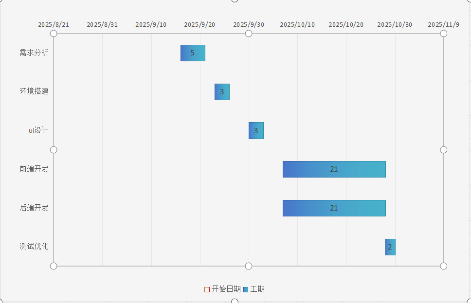

# 校园二手书循环与知识共享平台项目进度计划

## 一、项目基本信息
| 项目名称                 | 校园二手书循环与知识共享平台（微信小程序+Flask后端） |
|--------------------------|---------------------------------------------------|
| 项目目标                 | 解决校园二手书交易安全、价格不透明、检索低效等问题，附加笔记共享功能 |
| 开发周期                 | 8周（2个月）                                      |
| 技术栈                   | 前端：微信小程序原生开发+Vant Weapp组件库；后端：Python Flask+MySQL；版本控制：Git+GitHub |
| 负责人及团队             | 4人团队（产品设计1人+后端开发1人+前端开发1人+测试1人） |

## 二、项目背景与意义
1. **需求痛点**  
   - 毕业生教材/笔记闲置浪费，低年级购书成本高（单本50-200元）；  
   - 现有渠道（闲鱼/QQ群）缺乏校园专属功能（课程标签检索、自提点担保）；  
   - 私下交易无监管，存在“付款不发货”“货不对板”等信任问题；  
   - 带笔记的教材价值未被挖掘，卖家难增值，买家难筛选。  

2. **项目价值**  
   - 为学生：降低购书成本，提高闲置资源利用率，辅助学习（笔记共享）；  
   - 为校园：推动绿色低碳校园建设，优化知识传递生态；  
   - 技术实践：通过小程序+后端分离架构，完成完整的全栈开发流程。  

## 三、核心功能模块（已明确）
1. **用户管理模块**  
   - 注册/登录（手机号验证+微信快捷登录）；  
   - 身份绑定（卖家/买家）、个人信息管理（专业/年级）；  
   - 信用积分系统（初始100分，交易扣减/完成返还）。  

2. **二手书交易模块**  
   - 书籍发布（课程标签、新旧程度、实拍图、价格设置）；  
   - 检索与比价（按课程/专业/年级筛选，显示历史成交价）；  
   - 订单管理（创建订单、自提点选择、交易状态跟踪）；  
   - 自提点担保（线下验货后转账，平台记录订单）。  

3. **笔记资源模块**  
   - 笔记上传（卖家关联书籍上传电子版笔记）；  
   - 笔记获取（买家免费领取或1元解锁，收益归卖家）；  
   - 笔记预览（支持部分内容展示，吸引购买）。  

4. **平台辅助功能**  
   - 价格对比工具（同条件书籍价格排序）；  
   - 消息通知（订单状态变更、新笔记提醒）；  
   - 自提点管理（图书馆/教学楼/寝室点列表及开放时间）。  

## 四、任务分解（按阶段拆分，含环境配置）

### 阶段1：需求分析与设计（第1-2周，共8项）
1. 细化用户需求清单（明确P0/P1级功能，如优先开发“书籍发布+检索”）  
2. 绘制用户流程图（注册→发布→检索→下单→完成交易全流程）  
3. 设计产品原型（Axure绘制注册页、书籍发布页、检索页等核心页面）  
4. 输出UI设计规范（主色调、按钮样式、字体大小，适配小程序风格）  
5. 设计数据库表结构（用户表/书籍表/订单表/笔记表，明确字段与关联）  
6. 编写《数据库设计文档》（含字段类型、约束、表关系说明）  
7. 确定前后端接口规范（RESTful风格，定义请求/响应格式）  
8. 编写《接口文档初稿》（含用户/书籍/订单核心接口的URL与参数）  

### 阶段2：环境搭建（第2周，共5项）
#### （1）前端环境配置  
9. 安装微信开发者工具（稳定版Stable Build），配置小程序基础设置（AppID）  
10. 搭建小程序项目框架（创建pages目录、配置app.json路由）  
11. 集成Vant Weapp组件库（通过npm安装，配置usingComponents）  

#### （2）后端环境配置  
12. 安装Python 3.8+，配置虚拟环境（venv），安装依赖（flask、flask-sqlalchemy等）  
13. 搭建MySQL 8.0环境，创建项目数据库（second_hand_book），配置字符集（utf8mb4）  

### 阶段3：后端开发（第3-6周，共8项）
14. 初始化Flask项目结构（按模块划分：models/routes/utils/config）  
15. 实现数据库模型映射（基于SQLAlchemy，创建用户/书籍/订单/笔记模型类）  
16. 开发用户接口（注册/登录/身份绑定，含密码加密、JWT token生成）  
17. 开发书籍接口（发布/查询/筛选，支持多条件过滤与分页）  
18. 开发订单接口（创建订单、更新状态、信用积分扣减/返还逻辑）  
19. 开发笔记接口（上传/获取/解锁权限控制，关联书籍ID）  
20. 开发历史价格接口（统计近1个月同款书籍成交价，隐去用户隐私）  
21. 编写《后端接口文档终稿》（补充接口测试用例、错误码说明）  

### 阶段4：前端开发（第3-6周，共7项）
22. 开发用户注册/登录页面（表单校验、微信快捷登录按钮）  
23. 开发个人中心页面（显示信用积分、身份信息、我的发布/订单）  
24. 开发书籍发布页面（课程标签选择器、图片上传组件、价格输入框）  
25. 开发书籍检索与列表页（搜索框+多维度筛选栏、比价结果展示）  
26. 开发书籍详情页（图片轮播、笔记预览、卖家信息、下单按钮）  
27. 开发订单管理页面（待自提/已完成标签页、自提点选择弹窗）  
28. 开发笔记上传/解锁页面（文件选择器、免费/付费选项、解锁按钮）  

### 阶段5：测试与优化（第7-8周，共4项）
29. 编写《测试用例文档》（覆盖用户注册、书籍发布、下单全流程）  
30. 执行单元测试（后端接口参数校验、前端组件渲染逻辑）  
31. 执行集成测试（模拟真实场景，验证前后端数据交互）  
32. 修复Bug并优化体验（如图片加载慢、筛选结果错乱、操作步骤简化）  

## 五、环境配置要求明细
| 环境类型       | 具体要求                                                                 |
|----------------|--------------------------------------------------------------------------|
| 前端开发环境   | 微信开发者工具（v1.06+）、Node.js（v14+）、Vant Weapp（v1.10+）          |
| 后端开发环境   | Python（3.8+）、Flask（2.0+）、MySQL（8.0+）、PyCharm（或VS Code）       |
| 依赖包（后端） | flask-cors（跨域）、pyjwt（身份验证）、pymysql（数据库驱动）、python-dotenv（环境变量） |
| 版本控制       | Git（2.30+）、GitHub仓库（已创建：HustSE_2025）                          |
| 测试工具       | Postman（接口测试）、微信小程序开发者工具自带调试器                        |

## 六、项目计划与预期成果
1. **时间节点**  
   - 第1-2周：完成需求设计与环境搭建；  
   - 第3-6周：并行开发前后端功能，每周同步接口对接；  
   - 第7周：完成测试与Bug修复；  
   - 第8周：优化体验，准备小程序审核材料。  

2. **预期交付物**  
   - 可运行的微信小程序（含所有核心功能）；  
   - 部署完成的Flask后端服务（支持接口调用）；  
   - 全套项目文档（需求说明书、设计文档、接口文档、测试报告）；  
   - GitHub仓库源代码（含分支管理记录）。  

